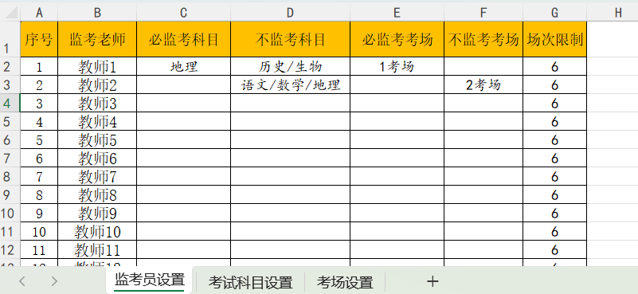
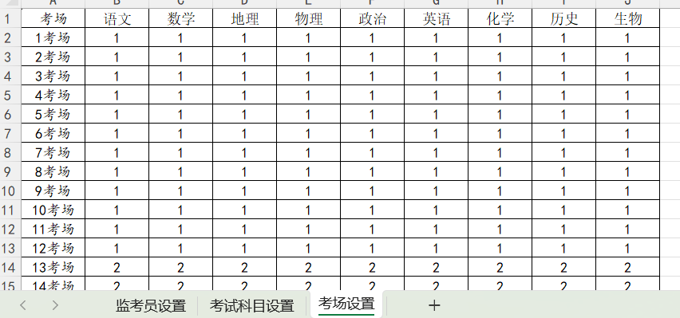
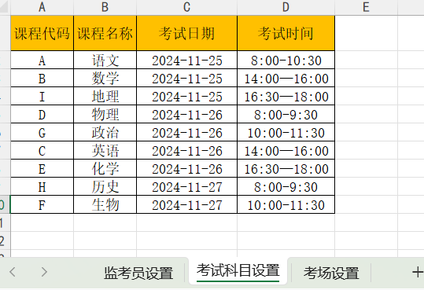
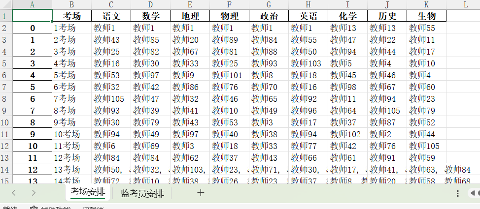
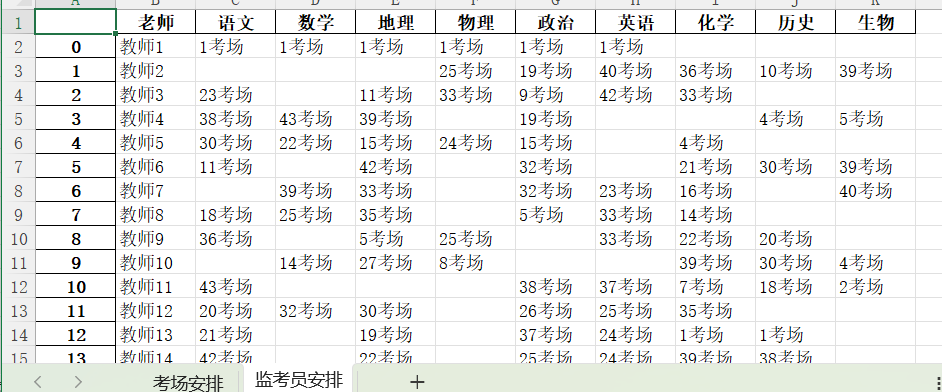

# invigilation_schedule

> 监考安排 https://www.v2ex.com/t/1092902

## 1 概要

目前手动解决方法：（有时需要 2 次才能排出监考表）

1. 先根据场次限制，制作出所有老师的监考次数。
2. 根据特殊要求先安排必监考科目和考场和不监考科目和考场的老师，逐个复制粘贴到监考表。 单科目一个人不能重复出现。还需要考虑到能一天安排安排的就别分散安排。
3. 统计老师名单中所有老师在各科中出现的次数以及总的监考场次。然后手动逐一调整。

## 2 示例数据

### 2.1 输入

监考员有很多个性化的要需求

考场和科目对应的数字是本场考试安排的监考人数

## 2.2 输出

